# 今週何知った？ week:16

## 各自発表


> [name=ken3ypa]

# しっかり学ぶmermaid記法 〜フローチャート編〜

## きっかけ
- [GitHub がMermaid記法をサポート](https://github.blog/2022-02-14-include-diagrams-markdown-files-mermaid/)
- 決済まわりを触っていて、シーケンス図が頻出

=> これはすらすらかけるようになりたい

## mermaidとは
- markdown記法にインスパイアされた、JavaScriptベースの図表作成ライブラリ。mermaid記法を用いて、開発にまつわる諸々の図作成できる
- 公式：http://mermaid-js.github.io/mermaid/#/
- ライブエディタ: https://mermaid-js.github.io/mermaid-live-editor/edit

### 作れる図
- フローチャート / シーケンス図 / クラス図 / ステート図 / ER図 / ユーザージャーニー / ガントチャート / 円グラフ…etc

### 他のライブラリとの比較
- 似たようなライブラリとしてはPlantUMLがある。記法については差異はあるものの、出来ることはほぼ同じ（のように見える。深掘りはしていない）
    - https://qiita.com/Tachy_Pochy/items/ee79fc5c572fa5661989

### おすすめの学び方
- 記法の種類が多いので全部を学ぼうとすると途中で力尽きがち。作りたい図に絞って学ぶとよい
- 一つの図に絞れば記法はそう多くないので、2時間ぐらいやればガッツリ書けるようになる
## シーケンス図の構文について
ここではシーケンス図作成のために用意されている14の記法について見ていく

### 1 Participants
- シーケンス図における主体を記載できる。
- 省略も可能だが、participantを明示することで並び順を指定することが可能

#### 省略した例
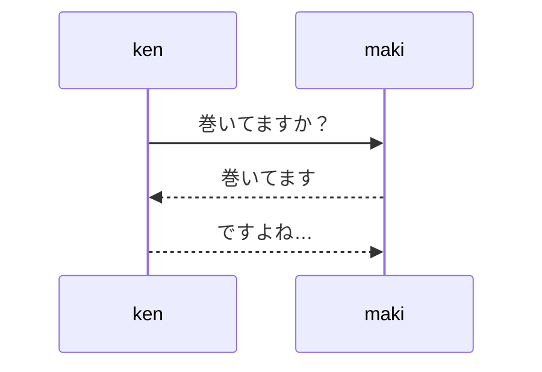
```mermaid
sequenceDiagram
  ken->>maki: 巻いてますか？
  maki-->>ken: 巻いてます
  ken-->>maki: ですよね…
```

#### 明記した例
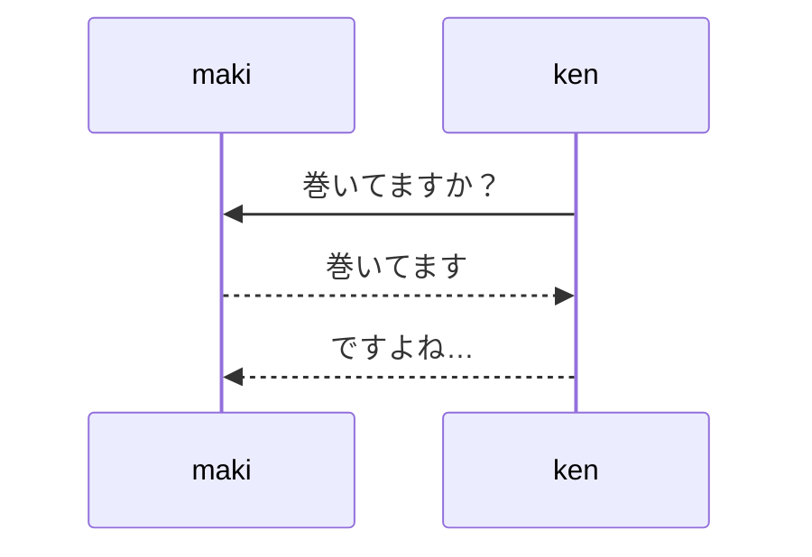
```mermaid
sequenceDiagram
  participant maki
  participant ken
  ken->>maki: 巻いてますか？
  maki-->>ken: 巻いてます
  ken-->>maki: ですよね…
```

### 2 Actors
- Participantsの亜種。図中で表示されるアイコンが棒人間になる

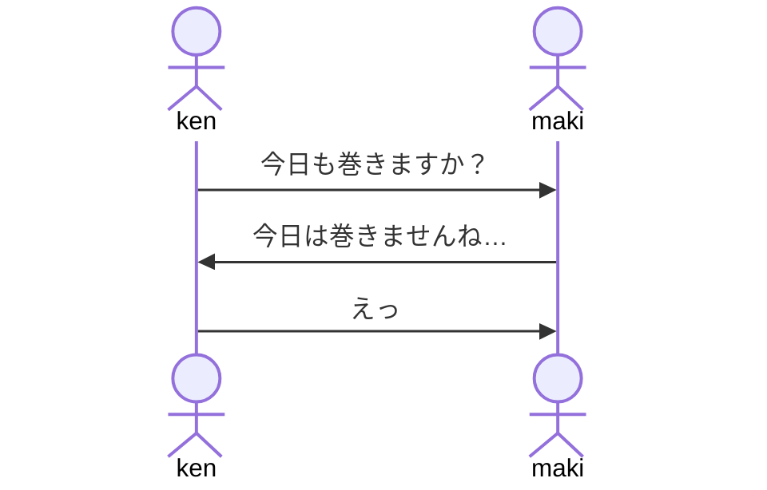
```mermaid
sequenceDiagram
 actor ken
 actor maki
　　ken->>maki: 今日も巻きますか？
 maki->>ken: 今日は巻きませんね…
 ken->>maki: えっ
```

### 3 Aliases
participant, actor にAliasを指定できる。SQLっぽい

```md
participant <alias_name> as <name>
actor <alias_name> as <name>
```

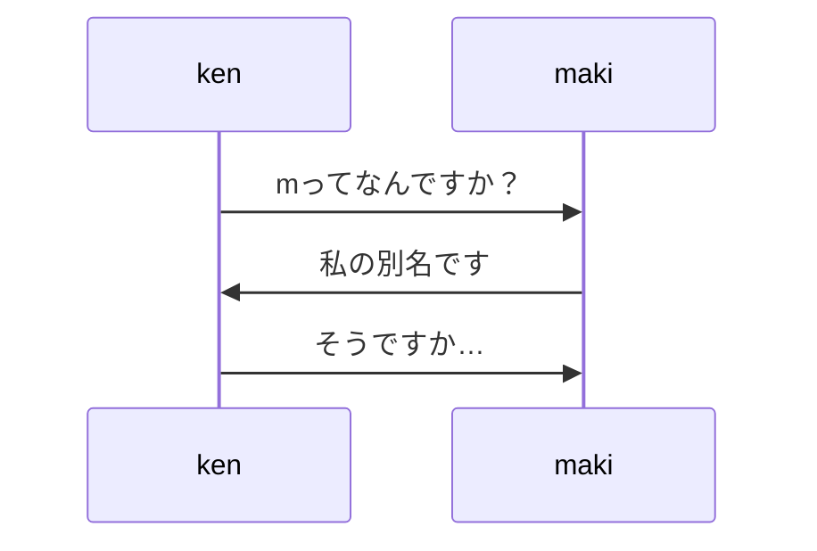
```mermaid
sequenceDiagram
  participant k as ken
  participant m as maki
  k->>m: mってなんですか？
  m->>k: 私の別名です
  k->>m: そうですか…
```

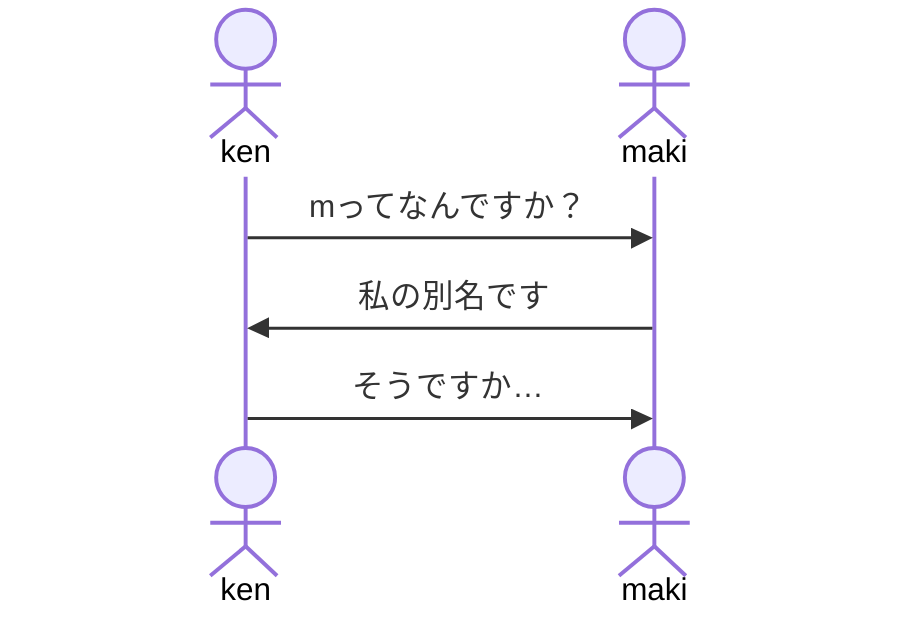
```mermaid
sequenceDiagram
  actor k as ken
  actor m as maki
  k->>m: mってなんですか？
  m->>k: 私の別名です
  k->>m: そうですか…
```


### 4 Messages
8種類の矢印と `: `以降に指定する文言を元に、A to B へのメッセージを記載できる。

```
  a->b: message
```


Type|説明|
--- | --- |
 ->|矢印なしの直線|
-->|ドット付き直線|
->>|矢印あり直線|
-->>|ドット・矢印あり直線|
-x|	終端×・矢印あり直線|
--x|終端×・矢印・ドットあり直線|
-)|かっこいい矢印|
--)|ドット付きかっこいい矢印|

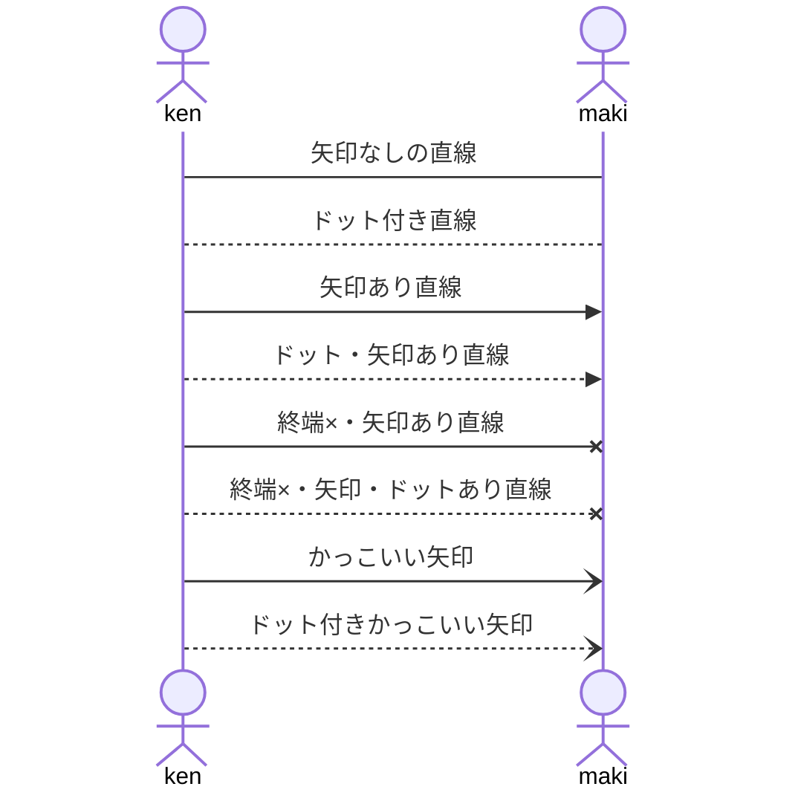
```mermaid
sequenceDiagram
  actor k as ken
  actor m as maki
  k->m: 矢印なしの直線
  k-->m: ドット付き直線
  k->>m: 矢印あり直線
  k-->>m: ドット・矢印あり直線
  k-xm: 終端×・矢印あり直線
  k--xm: 終端×・矢印・ドットあり直線
  k-)m: かっこいい矢印
  k--)m: ドット付きかっこいい矢印
```

### 5 Activations
有効化・無効化を設定できる
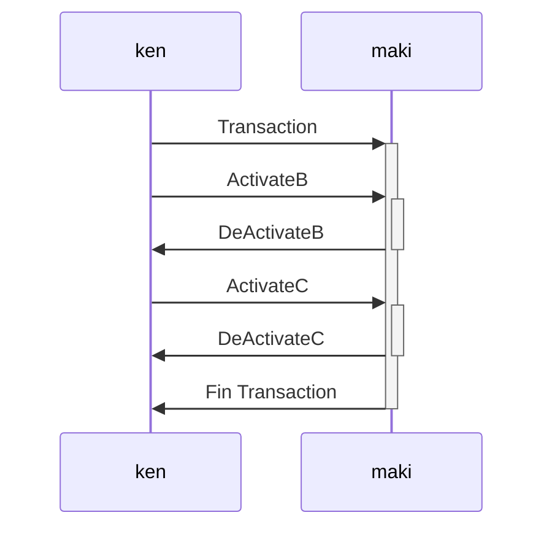
```mermaid
sequenceDiagram
  ken->>+maki: Transaction
  ken->>+maki: ActivateB
  maki->>-ken: DeActivateB
  ken->>+maki: ActivateC
  maki->>-ken: DeActivateC
  maki->>-ken: Fin Transaction
```

### 6 Notes

Note <right of  / left of / over> message でコメントを残せる

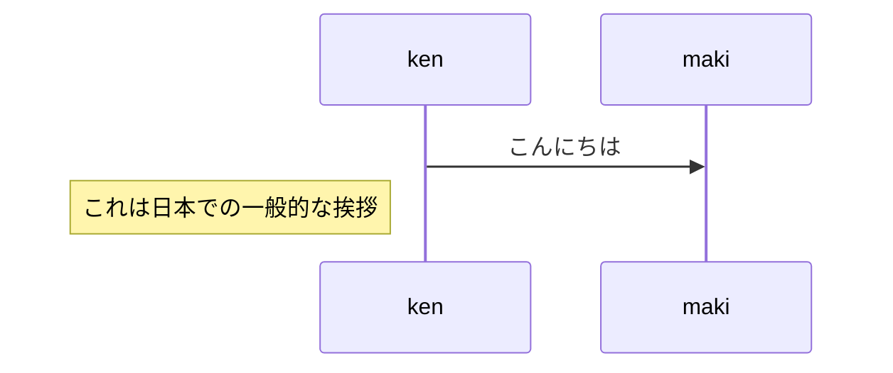
```mermaid
sequenceDiagram
  ken->>maki: こんにちは
  Note left of ken: これは日本での一般的な挨拶
```


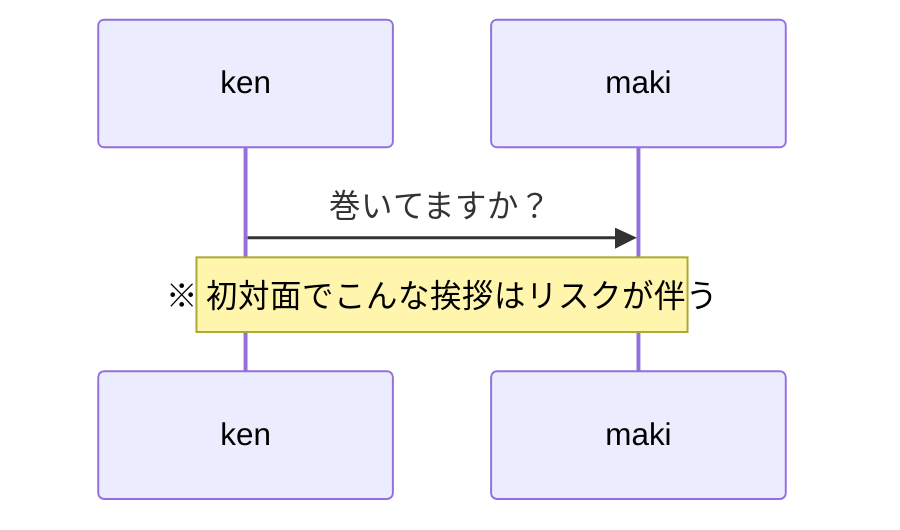
```mermaid
sequenceDiagram
  ken->>maki: 巻いてますか？
  Note over ken, maki: ※ 初対面でこんな挨拶はリスクが伴う
```

### 7 Loops
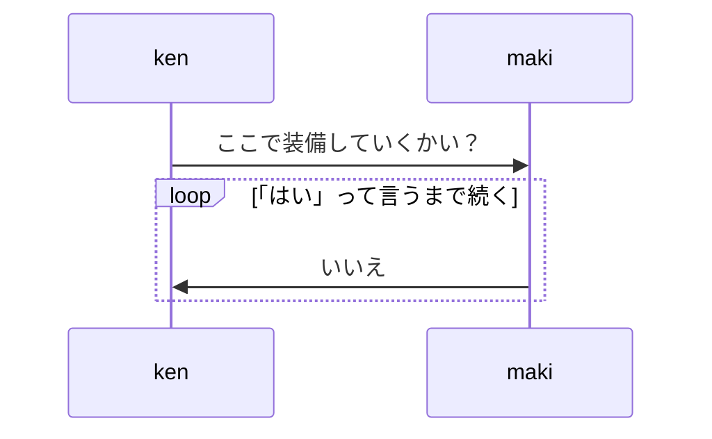
```mermaid
sequenceDiagram
  ken->>maki: ここで装備していくかい？
  loop 「はい」って言うまで続く
    maki->>ken: いいえ
   end
```

### 8 Alt
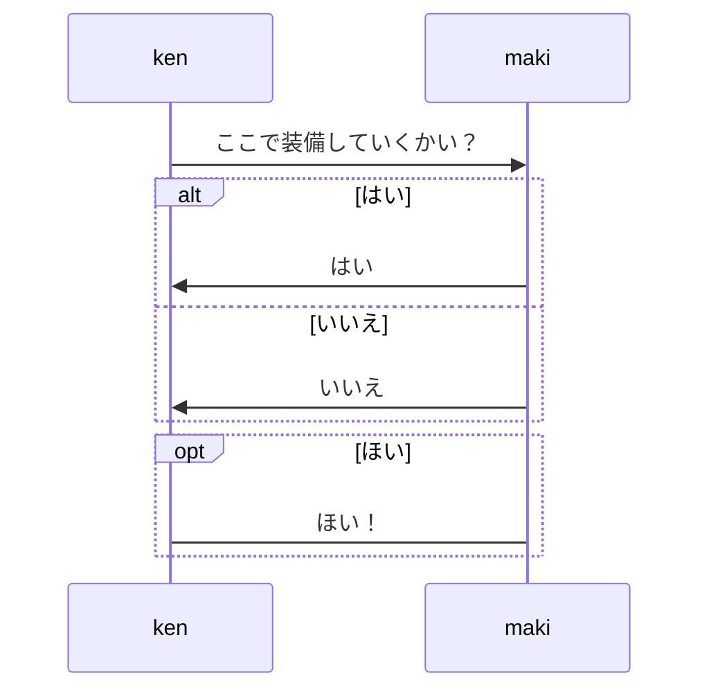
```mermaid
sequenceDiagram
  ken->>maki: ここで装備していくかい？
  alt はい
  　　  maki->>ken: はい
  else いいえ
    　　maki->>ken: いいえ
  end
  opt ほい
  　  　maki->ken: ほい！
  end
```

### 9 Parallel
並行で起こっている事象について表すことができる

```md
par [Action 1]
... statements ...
and [Action 2]
... statements ...
and [Action N]
... statements ...
end
```

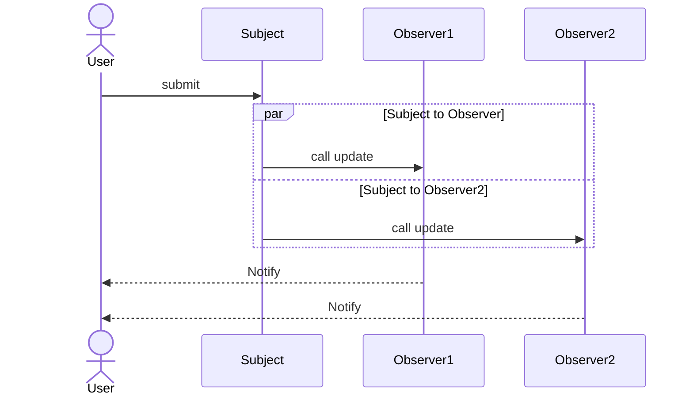
```mermaid
sequenceDiagram
　　　　　　　　actor User
    User->>Subject: submit
    par Subject to Observer
        Subject->>Observer1: call update
    and Subject to Observer2
        Subject->>Observer2: call update
    end
    Observer1-->>User: Notify
    Observer2-->>User: Notify
```

### 10 Background Highlighting
`rect <rgb/rgba>  ~ end`で囲うことで、スコープ内のフローへ背景色を追加できる

```
rect rgb(0, 255, 0)
... content ...
end

rect rgba(0, 0, 255, .1)
... content ...
end
```

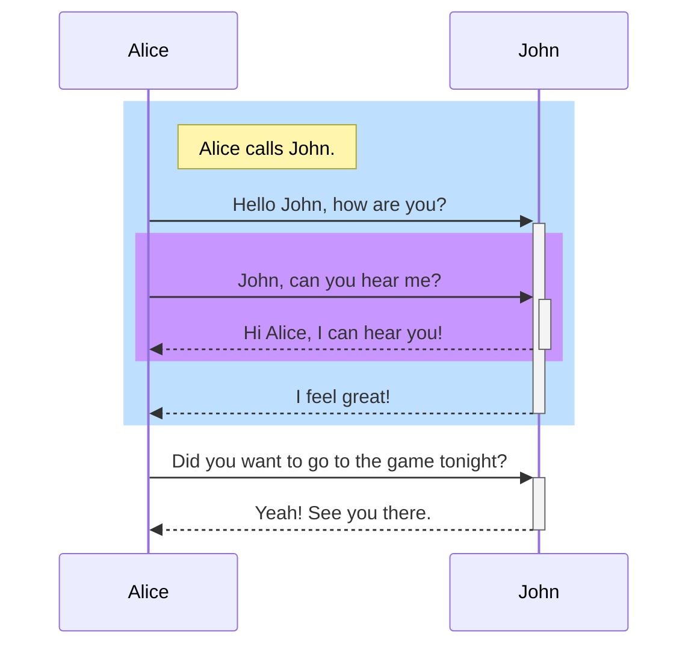
```mermaid
sequenceDiagram
    participant Alice
    participant John

    rect rgb(191, 223, 255)
    note right of Alice: Alice calls John.
    Alice->>+John: Hello John, how are you?
    rect rgb(200, 150, 255)
    Alice->>+John: John, can you hear me?
    John-->>-Alice: Hi Alice, I can hear you!
    end
    John-->>-Alice: I feel great!
    end
    Alice ->>+ John: Did you want to go to the game tonight?
    John -->>- Alice: Yeah! See you there.
```

### 11 Comments
mermaid中にコメントを残したい場合は %% で記載可能。
つけたコメントはパーサから無視されるため、表示には影響しない。


```md
sequenceDiagram
    Alice->>John: Hello John, how are you?
    %% this is a comment
    John-->>Alice: Great!
```


### 12 Entity codes to escape characters
エンティティコードを指定して文字や記号の実体参照ができる

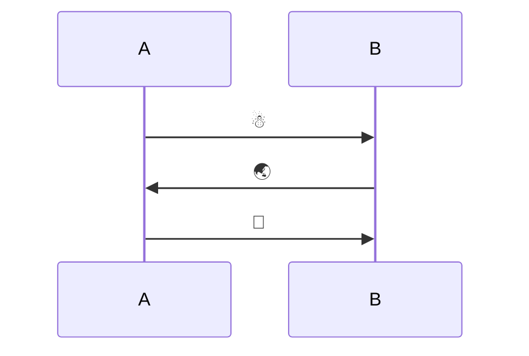
```mermaid
sequenceDiagram
    A->>B: #9731;
    B->>A: #127759;
    A->>B: #128511;
```

### 13 sequenceNumbers
`autonumber` を記載するか、optionを設定することでフローに番号を振ることができる

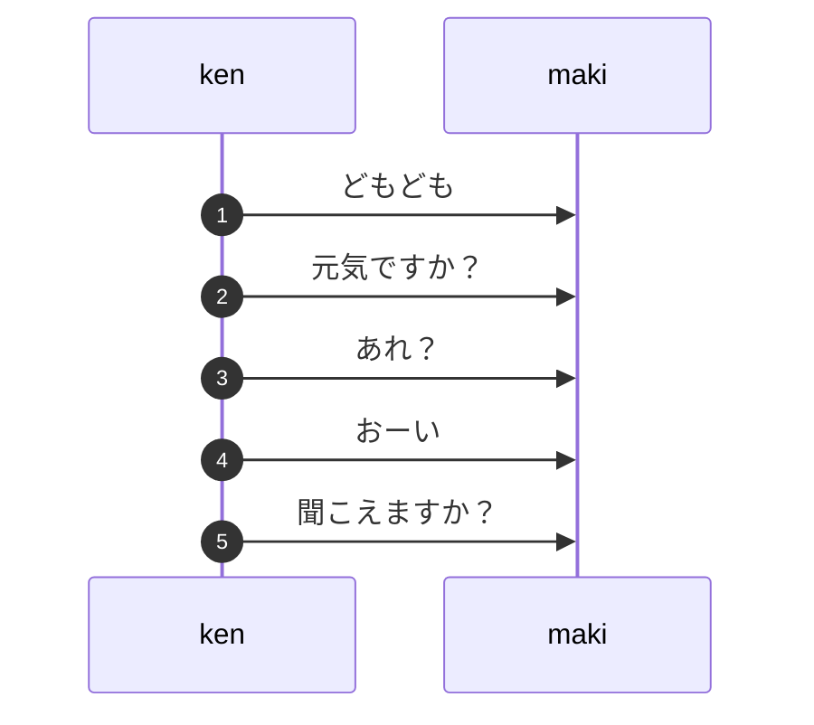
```mermaid
sequenceDiagram
    autonumber
    ken->>maki: どもども
    ken->>maki: 元気ですか？
    ken->>maki: あれ？
    ken->>maki: おーい
    ken->>maki: 聞こえますか？
```

### 14 Actor Menus
`link [participant name] link_name @ URL` で、participant をマウスオーバーした際にリンクを表示させることができる（が、esaやHackMD、GitHubなどmermaid をサポートしている各種ツールでもこの機能は未対応）

```md
sequenceDiagram
    participant Alice
    participant John
    link Alice: google @ https://dashboard.contoso.com/alice
    link Bob: google @ https://dashboard.contoso.com/bob
    Alice->>John: Hello John, how are you?
 ```

### 練習
https://developer.amazon.com/ja/docs/amazon-pay-checkout/overview.html

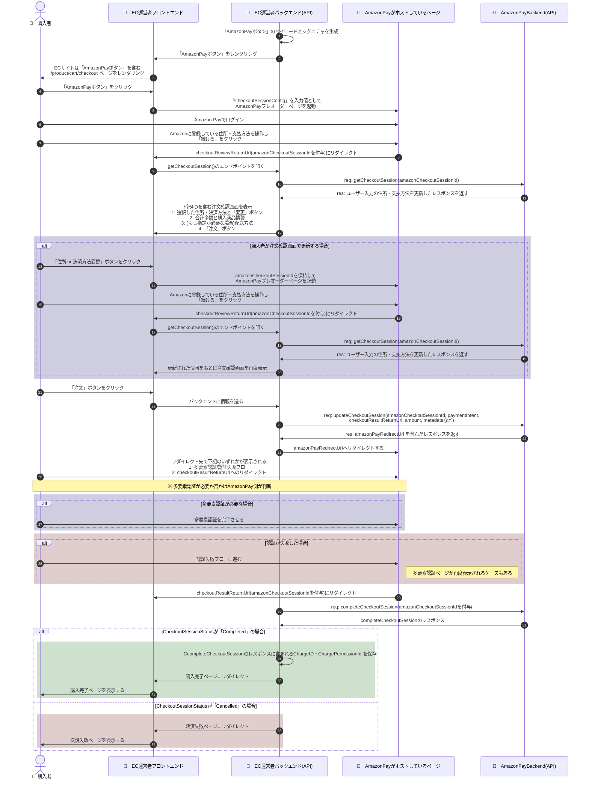
```mermaid
sequenceDiagram
　　　　autonumber

  %% 登場人物
  actor b as #128102;　購入者
  participant mf as #128722;　EC運営者フロントエンド
  participant mb as #128331;　EC運営者バックエンド(API)
  participant a as #128509;　AmazonPayがホストしているページ
  participant ab as #128331;　AmazonPayBackend(API)
  
  %% 決済処理の流れについて
  mb->>mb: 「AmazonPayボタン」のペイロードとシグニチャを生成
  mb->>mf: 「AmazonPayボタン」をレンダリング
  mf->>b: ECサイトは「AmazonPayボタン」を含む<br> /product/cart/checkout ページをレンダリング
  b->>mf: 「AmazonPayボタン」をクリック
  mf->>a: 「CheckoutSessionConfig」を入力値として<br> AmazonPayプレオーダーページを起動
  b->>a: Amazon Payでログイン
  b->>a: Amazonに登録している住所・支払方法を操作し<br> 「続ける」をクリック
  a->>mf: checkoutReviewReturnUrl(amazonCheckoutSessionIdを付与)にリダイレクト
  mf->>mb: getCheckoutSession()のエンドポイントを叩く
  mb->>ab: req: getCheckoutSession(amazonCheckoutSessionId)
  ab->>mb: res: ユーザー入力の住所・支払方法を更新したレスポンスを返す
  mb->>mf: 下記4つを含む注文確認画面を表示<br> 1: 選択した住所・決済方法と「変更」ボタン<br> 2: 合計金額と購入商品情報<br> 3: (もし指定が必要な場合)配送方法<br> 4: 「注文」ボタン
  rect rgba(10,10,100,0.2)
  alt 購入者が注文確認画面で更新する場合
    b->>mf: 「住所 or 決済方法変更」ボタンをクリック
    mf->>a: amazonCheckoutSessionIdを保持して<br>AmazonPayプレオーダーページを起動
    b->>a: Amazonに登録している住所・支払方法を操作し<br>「続ける」をクリック
    a->>mf: checkoutReviewReturnUrl(amazonCheckoutSessionIdを付与)にリダイレクト
    mf->>mb: getCheckoutSession()のエンドポイントを叩く
    mb->>ab: req: getCheckoutSession(amazonCheckoutSessionId)
    ab->>mb: res: ユーザー入力の住所・支払方法を更新したレスポンスを返す
    mb->>mf: 更新された情報をもとに注文確認画面を再度表示
  end
  end
  b->>mf: 「注文」ボタンをクリック
  mf->>mb: バックエンドに情報を送る
  mb->>ab: req: updateCheckoutSession(amazonCheckoutSessionId, paymentIntent,<br>checkoutResultReturnUrl, amount, metadataなど)
  ab->>mb: res: amazonPayRedirectUrl を含んだレスポンスを返す
  mb->>a: amazonPayRedirectUrlへリダイレクトする
  b->>a: リダイレクト先で下記のいずれかが表示される<br>1: 多要素認証/認証失敗フロー<br>2: checkoutResultReturnUrlへのリダイレクト
  Note over b, a: ※ 多要素認証が必要か否かはAmazonPay側が判断
  rect rgba(10,10,100,0.2)
  alt 多要素認証が必要な場合
    b->>a: 多要素認証を完了させる
  end
  end
  rect rgba(100,10,10,0.2)
  alt 認証が失敗した場合
    b->>a: 認証失敗フローに進む
    Note right of a: 多要素認証ページが再度表示されるケースもある
  end
  end
  a->>mf: checkoutResultReturnUrl(amazonCheckoutSessionIdを付与)にリダイレクト
  mb->>ab: req: completeCheckoutSession(amazonCheckoutSessionIdを付与)
  ab->>mb: completeCheckoutSessionのレスポンス
  alt CheckoutSessionStatusが「Completed」の場合
    rect rgba(10,100,10,0.2)
    mb->>mb: CcompleteCheckoutSessionのレスポンスに含まれるChargeID・ChargePermissionId を保存
    mb->>mf: 購入完了ページにリダイレクト
    mf->>b: 購入完了ページを表示する
    end
  else CheckoutSessionStatusが「Cancelled」の場合
    rect rgba(100,10,10,0.2)
    mb->>mf: 決済失敗ページにリダイレクト
    mf->>b: 決済失敗ページを表示する
    end
  end
```

> [name=makicamel]

## ストリーム
- ストリームとは  
  > データを、比較的小さい単位が連続したものと捉え、上流から下流へ「流れるもの」とみなし、そのデータの入出力・送受信（途中段階を含む）を最小限の滞留とさせ低遅延処理となるように扱う形態を指す。またその操作のための抽象データ型を指す。
[ストリーム (プログラミング) - Wikipedia](https://ja.wikipedia.org/wiki/ストリーム_(プログラミング))

- ふつうにファイルを読んだ場合、ファイルをすべてメモリ上に展開する
  - ファイルが大きくなるとメモリの枯渇、パフォーマンスの悪化の可能性が出る
  - ストリームはファイルの一部を読み込み・書き込みする


ー [ハンズオン Node.js](https://www.oreilly.co.jp/books/9784873119236/) p.122

ref [Net::HTTPResponse#read_body (Ruby 3.1 リファレンスマニュアル)](https://docs.ruby-lang.org/ja/latest/method/Net=3a=3aHTTPResponse/i/read_body.html)

## http モジュール

「TODO リストを返すサーバ」は以下のように実装できる

```javascript
const todos = [
  { id: 1, title: 'ネーム', completed: false },
  { id: 2, title: '下書き', completed: true }
]

// req は読み込みストリーム、res は書き込みストリーム
const server = http.createServer((req, res) => {
  // リクエストの URL や HTTP メソッドに応じて適切なレスポンスを返す
  if (req.url === '/api/todos') {
    if (req.method === 'GET') {
      // GET メソッドの場合、全 TODO を JSON 形式で返す
      res.setHeader('Content-Type', 'application/json')
      return res.end(JSON.stringify(todos))
    }
    // GET 以外の HTTP メソッドはサポートしないため 405(Method Not Allowed)
    res.statusCode = 405
  } else {
    // /api/todos 以外の URL はないので 404 (Not Found)
    res.statusCode = 404
  }
  res.end()
}).listen(3000)
```

- `createServer` はコールバック関数を受け取る
  - コールバック関数は 2 つ引数を受け取る
  - 第一引数はリクエストを表す。読み込みストリーム
  - 第二引数はレスポンスを表す。書き込みストリーム

上記のサーバにアクセスするリクエストは以下のように実装できる

```javascript
http.request('http://localhost:3000/api/todos', res => {
  let responseData = ''
  console.log('statusCode', res.statusCode)
  res.on('data', chunk => responseData += chunk)
  res.on('end', () => console.log('responseData', JSON.parse(responseData)))
}).end()
```

- `request` メソッドは書き込みストリームである `http.ClientRequest` オブジェクトを返す
- リクエストは `request()` メソッドコール時ではなく `http.ClientRequest` オブジェクトの `end()` メソッドコール時に送信される

## Web アプリケーションフレームワーク
http モジュールは低レベルなので直接使うよりもふだんはフレームワーク経由で利用する  
特によく使われるのは [Express](https://expressjs.com/ja/) で、http モジュールを使うよりもシンプルに可読性高く書ける

```javascript
// http モジュールで対応メソッドを増やす場合、if 文の数が増える
const server = http.createServer((req, res) => {
  if (req.url === '/api/todos') {
    if (req.method === 'GET') {
      // ..
    }
    if (req.method === 'POST') {
      // ...
    }

// Express で対応メソッドを増やす場合、  Router の記述を増やす
// routes.todos.js
router.route('/')
  .get((req, res) => {
    // ...  
  })
  .post((req, res) => {
    // ...
  })
module.exports = router
// app.js
// /api/todos 以下のパスに対するリクエストのハンドリングを ./routes/todos モジュールに移譲
app.use('/api/todos', require('./routes/todos'))
// ...
```

```javascript
// http モジュールでパスパラメータの id を解釈する場合、正規表現を使う
const server = http.createServer((req, res) => {
  const match = req.url.match(/^\/api\/todos\/(\d+)\/?$/)
  if (match) {
    // 数字部分を取り出す
    const todoId = Number(match[1])
    // ...
  }

// Express でパスパラメータの id を解釈する場合、プレースホルダを利用できる
app.get('/api/todos/:id(\\d+)', (req, res) => {
  const todoId = Number(req.params.id)
  // ...
})
```

```javascript
// http モジュールでクエリパラメータを取得する場合、URL API で URL をパースする
// URL は第一引数に req.url、第二引数にベースの URL を指定する
new URL('/api/todos?completed=true', 'http://localhost:3000')
_.searchParams.get('completed')
// => true

const server = http.createServer((req, res) => {
  const url = new URL(req.url, `http://${req.headers.host}`)
  if (url.pathname === '/api/todos') {
    const completedFilter = url.searchParams.get('completed')
    // ...
  }

// Express では特別な処理をしなくても req.quesry から取得できる
app.get('/api/todos', (req, res) => {
  const completedFilter = req.query.completed
  // ...
})
```


## メモ欄
